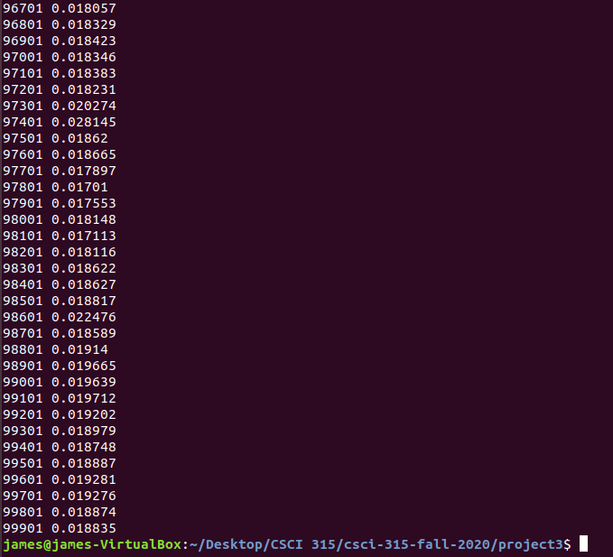
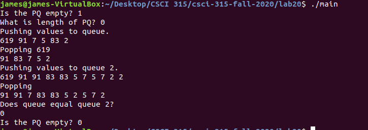
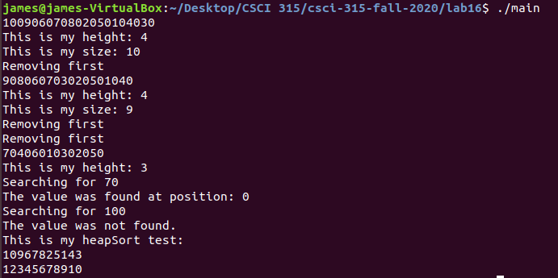

Portfolio
=========

Programming Projects
--------------------

*For access to my private project repositories, please [email me](mailto:jwood11190@gmail.com?subject=GitHub%20Access) with the subject line, GitHub Access.

---
### [Web Crawler / Balance Checker | CSCI 315](project1)

---
### [Balanced Binary Search Tree Comparison | CSCI 315](project2)

---
### [Priority Queue | CSCI 315](project3)

---
### [Binary Heap and Heapsort | CSCI 315](project4)

---

Ethics Papers
-------------

### [Intellectual Property](Ethics Papers/Intellectual Property.docx)

-   **Class: CSCI 332**  
-   **Grade: 80%**

### [Software Ethics](Ethics Papers/Software Ethics.docx)

-   **Class: CSCI 325** 
-   **Grade: 80%**

### [Meme Ethics](Ethics Papers/meme ethics.docx)

-   **Class: CSCI 330** 
-   **Grade: 80%**

---

Presentations
-------------

### [Register File for a Single Cycle Processor](Register File Pres.pptx)

- **Class: CSCI 330** 
- **Grade: 100%**

---

Page template forked from <a href="https://github.com/csu-cs/csci-portfolio">CSU-CS</a>

<!-- Remove above link if you don't want to attributive -->
